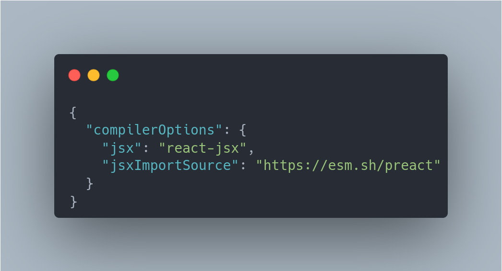
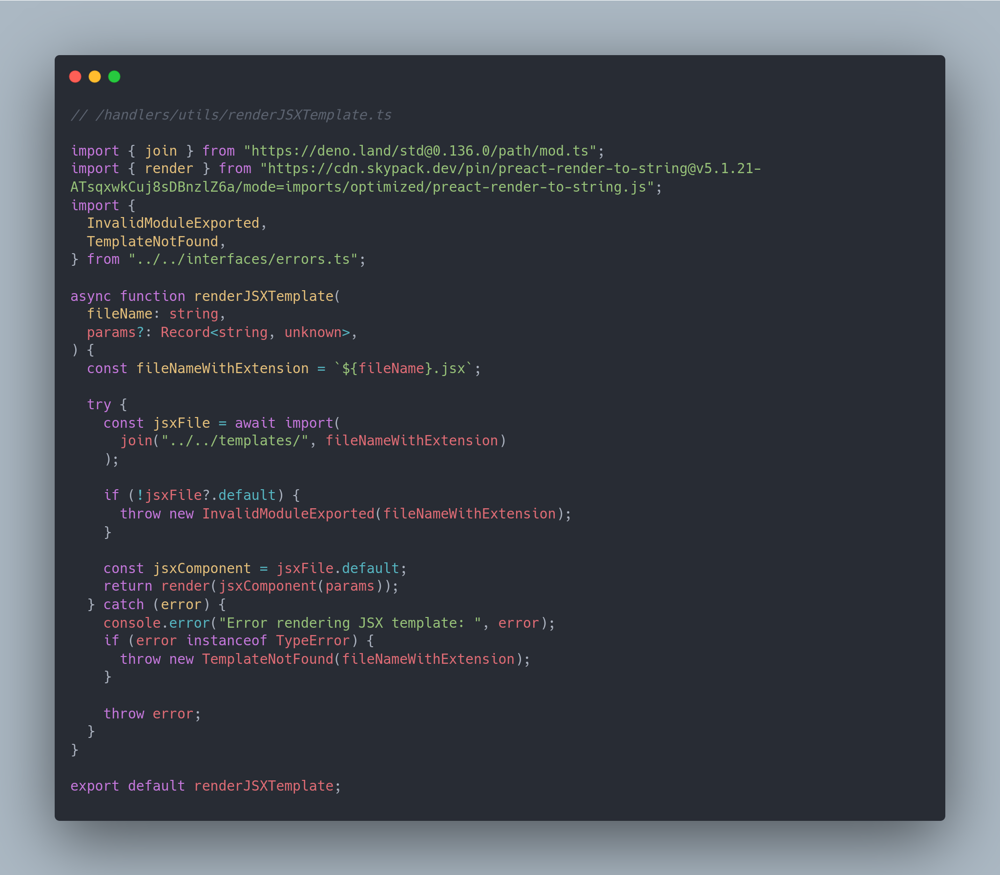
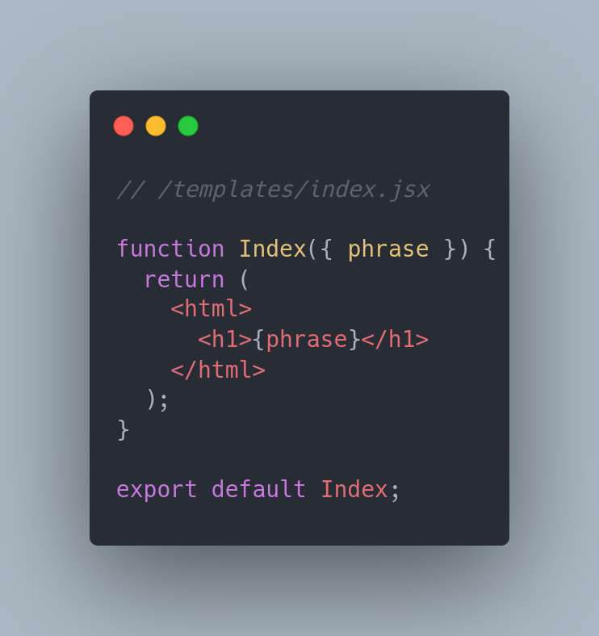
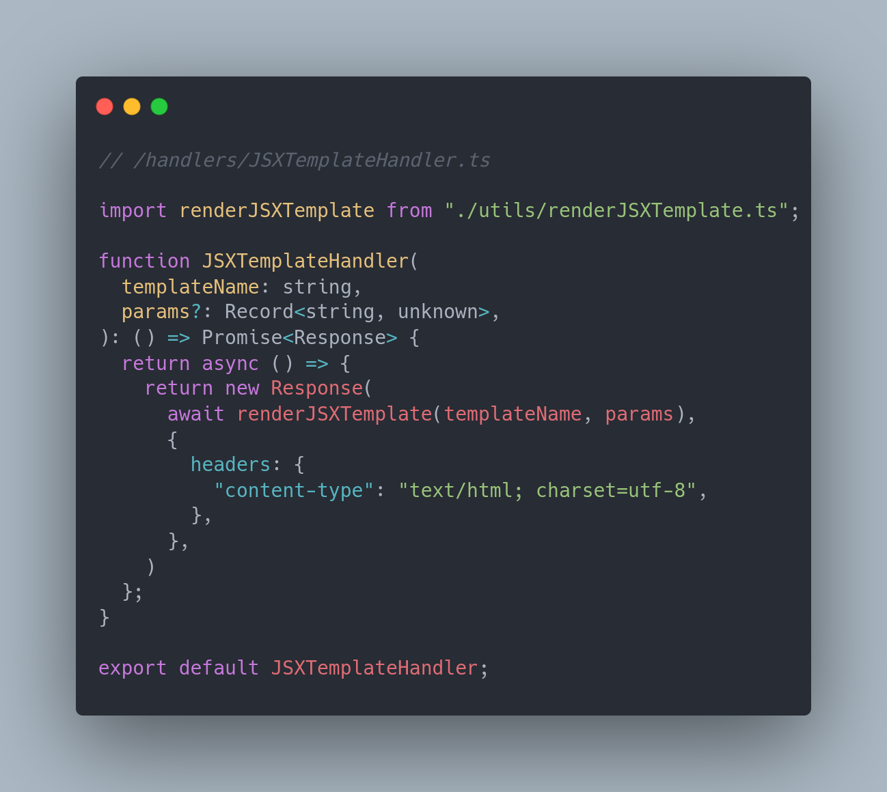
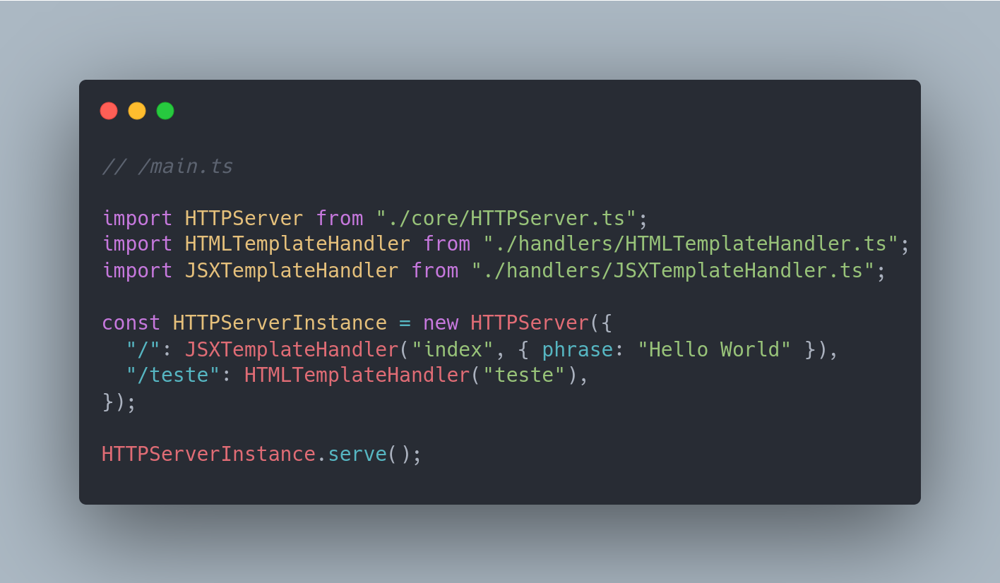

# Criando uma API de páginas estáticas básica com Deno :t-rex:

Bom dia! meus caros compatriotas mineradores das profundezas do StackOverflow, esses últimos dias meu uma vontade de como bom goiano dar uma sofrida e ao invés de botar Marilía Mendonça preferi mexer com o famoso (ainda é?) Deno que para minha grata supresa não foi sofrimento nenhum! :laughing:

Porque minha surpresa? Primeiro o ecossistema é bem simplista e receptivo para novos usuários a toolkit que vem instalada trazem ferramentas como `deno fmt` que formata o código de forma automática e um `deno lint` que achei sensacional fora que consegui configurar o debug no vscode tranquilamente, outro ponto que gostei bastante foi a standard library ser bem completa e vir com uma tipagem bem rica (sim sou um type junky).

Claro que há outros pontos que são os principais diferencias para o seu irmão mais velho Node, mas não vamos focar nas rusgas de família se quiser dar uma olhada a página inicial [deno.land](https://deno.land/) cita alguns outros pontos legais.

## Ideia inicial

Bem como objeto de estudo fiz uma API bem simples para testar algumas coisas como a integração do TypeScript com arquivos JSX que é algo que eu li na documentação do Deno e curti bastante, então tive a ideia de fazer algo só para servir páginas estáticas e ponto:thumbsup:, único diferencial aqui é que usei o máximo possível da standard library.


_**Disclaimer:**_ Olha a ideia não é ser perfeito inclusive se tiverem erros por favor me avise :rolling_on_the_floor_laughing: mas tentei deixar o escopo bem fechado porque se não nunca iria terminar fiz o que tinha proposto para mim mesmo e fiquei feliz com o resultado, tinha como fazer mais algumas coisas legais mas é aquilo quem não faz deploy de bug em produção não se diverte!. (Sim é só uma piada, caso esteja se perguntando)

### E a aventura se inicia

De início foi bem simples de instalar inclusive foi só um comando que baixava já um script de instalação e já o executava e pronto já estava com o deno instalado fiz alguns testes e depois configurei para usar o [asdf](https://asdf-vm.com/) e pronto com tudo configurado comecei a programar.

E começar a botar a mão na massa foi algo bem simples, por assim dizer, não é necessário criar dar um init para rodar basta dar um `deno run` e se tiver algo que ele precise instalar ele baixa na hora da execução e adiciona as informações da versão em um _package-lock.json_ algo bem semelhante ao que acontece no Node.js, mas de forma mais minimalista, por assim dizer já que não é necessário ter um _package.json_ para interagirmos e configurarmos, algo que achei ruim disso é que para o meu caso tive que criar um _makefile_ para agilizar um pouco a execução vamos falar disso mais à frente.

Olha aqui eu vou aos pouquinhos e vou explicar alguns detalhes de TypeScript para quem não está muito familiarizado não se perder.


Bem aqui já começam as diferenças Deno usa um esquema de import de libs externas via url, isso traz uma coisa ótima que é a possibilidade de usar arquivos independentes da onde estejam da internet se é possível fazer o download ele funciona.

Neste caso estou importando e já retirando somente a função de serve que vamos usar para iniciar o servidor.

Abaixo temos um tipo que explicita qual vai ser o "formato" de um objeto de rota, se pararmos para pensar o mínimo que precisamos para criar uma rota (endpoint para os mais íntimos) é ter uma ação e ter o "caminho" para essa ação ser executada, por exemplo o caminho pode ser um '/index' e a ação é entregar um simples HTML.

Criei isso para facilitar para quem for criar uma rota no futuro não ter que adivinhar ou ter que dar uma de detetive para descobrir os dados necessários para uma rota funcional ser criada.

Basicamente esse _**k**_ se refere a chave do objeto e que deve ser string, e essa mesma chave vai receber como valor uma Promise que retorna uma instância de response. Tabom ficou meio confuso mas basicamente eu vou ter um objeto JSON que só recebe chaves em texto como letras e frases e elas vão ter como valor uma função assíncrona que retorna a resposta para o cliente, isso vai ficar mais claro mais a frente.

Agora vamos fazer o core da nossa aplicação que é o que vai receber as chamadas e encaminhar para as rotas certas.


Bem vou me aprofundar mais na função _initServerHandler_ nela eu filtro os métodos como vou somente servir páginas estáticas quero receber somente chamadas do tipo 'GET', depois eu crio uma url isso é legal para poder pegar o pathname que o caminho, por exemplo, se eu colocar no meu navegador o endereço _https://localhost:7000/teste_ o pathname é _/teste_ isso é bem trivial, mas para nosso caso serve muito bem.

Lembra da nossa declaração _IRoute_ aqui que começa a brincadeira vamos acessar de forma direta a rota e já vamos executar a função que está salva nela, por exemplo, em um objeto como o abaixo:

```js

{

'/': async () =>  new  Response('Hello World')

}

```

Ao entrar na chave '/' ele me traz a função que mostra um _Hello World_ bem bonito para o usuário.

Agora mais abaixo temos a função **serve** nela que a brincadeira já começa a rolar, ela inicia a função _initServerHandler_ e faz um _bind_? O que seria esse tal de bind?

Bem para entendermos isso precisamos pensar em como essa função vai ser executada, pois, essa função ela vai ser entregue para o server, mas não irá ser executada ali, mas quando ele receber uma requisição e isso ocorre dentro de outro escopo e não na função, e, nessa altura como a função vai achar a instância se ele é somente uma função e nem sequer foi executada dentro da mesma? Para isso usamos o bind ele insere a propriedade **routes** que foi colocada na classe no momento da criação da instanciação do _**HTTPServer**_ que criamos e a deixa acessível dentro dela quase como se ela fosse um "parâmetro", mas é acessada como uma propriedade da função, por isso quando damos um _this.routes_ conseguimos acessar as rotas, ele acessa a propriedade routes da função e não da classe **HTTPServer**.

### E a aventura estava ficando sem fim

Essa brincadeira estava até bem divertida, mas eu já tinha tido ido o suficiente adentro da toca do coelho e estava satisfeito (Mundo de Alice vibes :leaves:). Então fiz uma função para renderizar HTML puro e arquivos JSX, bem arquivos HTML não tem muito segredo então vamos dar uma olhada em como fazer isso.

Algo que não sabia era que Typescript estava dando suporte nativo para JSX isso significa que podemos com algumas configurações importar estes arquivos e usá-los para renderizar páginas para nossos clientes.

Para isso precisamos fazer uma pequena configuração no nosso arquivo `tsconfig.json` o meu ficou dessa forma.



- O [`jsx`](https://www.typescriptlang.org/tsconfig#jsx) se refere a como o arquivo JSX vai ser construído ao ser importado, essa config `react-jsx` permite que usemos outra runtime, nesse caso estamos usando o Preact como vamos ver abaixo

- [`jsxImportSource`](https://www.typescriptlang.org/tsconfig#jsxImportSource) Essa propriedade em conjunto com a opção acima define qual vai ser o módulo que vai ser usado para importar o JSX e construir o componente ao ser exportado.

Agora temos a função que importa o arquivo JSX de forma genérica (não queremos ter que criar uma função para cada JSX que criemos não é?)



Não vou me apegar muito os detalhes de import ou da tipagem dos tipos, pois isso não é a mágica (e já conversamos sobre esse _Record_ mais acima também). O que ela faz é basicamente importar o arquivo e usar uma função de render do Preact e aqui está a mágica.

- Primeiro importamos a lib `preact-render-to-string` do cdn skypack ele tem bastante libs já configuradas para rodar no Deno, muita coisa que roda no Node funciona no Deno, mas algumas precisam de alteração principalmente as que fazem operações no disco, então já ter algo configurado facilita bastante.

- Mas na função nós importamos o componente de forma assíncrona (legal né? JavaScript às vezes nos proporciona essas boas surpresas :the_horns:), quando esse arquivo é importado a função já passa por uma transformação usando o _Preact_ que configuramos mais cedo e se torna um arquivo utilizável dentro do nosso código, não se esqueça que TypeScript transforma tudo em JavaScript antes de ser executado o JSX só passa por um processo um pouco diferente.



- Este arquivo acima é um componente que criei bem simples somente para demonstrar, veja que estou exportando ele como default isso ajuda na hora de importar na função acima, pois já sei bem onde acessar o componente no módulo.



- Com essa função de renderização podemos já usá-la no nosso handler e nele o arquivo é renderizado e adicionado um headers e uma response válida é retornada (sim algumas coisas são bem chatas quando não se usa um framework :cry:)

- E para utilizarmos este handler basta configurarmos a nossa rota, lembra do nosso HTTPServer vamos brincar com ele agora, mas não tem muita emoção (felizmente).



Se você tem uma memória boa (ou somente rolou a página para cima) vai lembrar da interface que o nosso `HTTPServer` recebe, basta mandar a rota e o _handler_ que é a função que executa a ação ao acessamos aquele endpoint e depois usarmos a função _serve_.

#### Executando

Para executar há um diferencial, Deno pede (insiste melhor dizendo) que você especifique as permissões que a aplicação deverá ter no nosso caso, é necessário a de _net_, pois é uma API web acho que está explicito o porque (ela precisa acessar a rede) e de _read_ pois vamos ler alguns arquivos.

Um ponto interessante é que se fossemos usar somente o import comum não precisaríamos, pois o mesmo já estaria incluso na hora que rodássemos a aplicação, mas como os arquivos que contém os componentes JSX são importados de forma assíncrona sendo lidos em tempo de execução, ele precisa que demos permissão, pois não é adicionado na hora que compilamos mas depois ou nunca depende se vamos acessar a rota que usa o componente.

Segue abaixo o código para executar o brinquedo.

`deno run --config tsconfig.json --allow-net --allow-read ./src/main.ts`

#### Depois de 20 mil léguas submarinas

Chegamos ao final espero que não tenha sido uma viagem para o mundo da Chatolândia a leitura desse texto, mas sim uma olhada pelo retrovisor após o hype do Deno passar do ecossistema e de algumas diferenças do seu irmão mais velho Node.js.