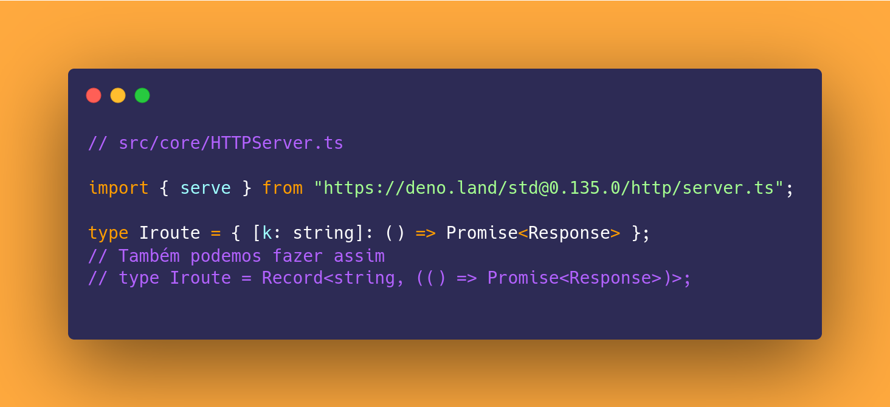
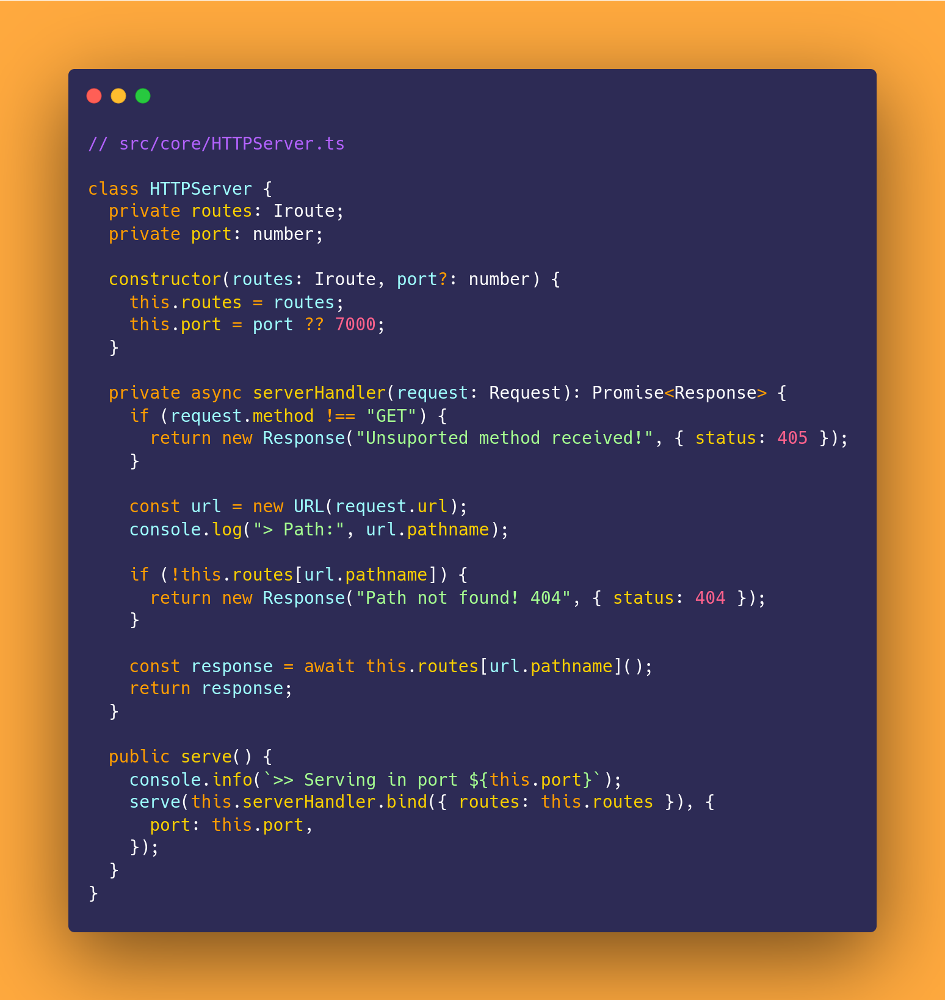

# Criando uma API de páginas estáticas básica com Deno :t-rex:

Bom dia meus caros compatriotas mineradores de StackOverflow, esses últimos dias meu uma vontade de como bom goiano dar uma sofrida e ao invés de botar Marilía Mendonça escolhi mexer com o famoso (ainda é?) Deno que para minha grata supresa não foi sofrimento nenhum! :laughing:

Por que minha surpresa? Primeiro o ecossistema é bem fácil e receptivo para novos usuários a toolkit que vem já instalada trazem ferramentas como `deno fmt` que formata o código de forma automática e um `deno lint` que achei sensacional fora que consegui configurar o debug no vscode tranquilamente, outro ponto que gostei bastante foi a standard library ser bem completa e vir com tipos (sim sou um type junky).

Claro que tem outros pontos que são os principais diferencias do seu irmão mais velho Node mas não vamos focar nas rusgas de familía se quiser dar uma olhada a página inicial [deno.land](https://deno.land/) cita alguns outros pontos legais.

## Ideia inicial

Bem como objeto de estudo fiz uma API bem simples para testar algumas coisas como a integração do TypeScript com arquivos JSX que é algo que eu vi na documentação do Deno e curti bastante, então tive a ideia de fazer algo só para servir páginas estáticas e ponto, único diferencial aqui é que usei o máximo possível da standard library.

_**Disclaimer:**_ Olha a ideia não é ser perfeito inclusive se tiverem erros por favor me avise :rolling_on_the_floor_laughing: mas tentei deixar o escopo bem fechado porque se não nunca iria terminar fiz o que tinha proposto para mim mesmo e fiquei feliz com o resultado, tinha como fazer mais algumas coisas legais mas é aquilo quem não faz deploy em produção não se diverte!.

### E a aventura se inicia

De ínicio foi bem simples de instalar inclusive foi só um comando que baixava já um script de instalação e já o executava e pronto já estava com o deno instalado fiz alguns testes e depois configurei para usar o [asdf](https://asdf-vm.com/) e pronto com tudo configurado comecei a programar.

E começar a botar a mão na massa foi algo bem simples por assim dizer não é necessário criar dar um init para rodar basta dar um `deno run` e se tiver algo que ele precise instalar ele baixa na hora da execução e adiciona as informações da versão em um _package-lock.json_ algo bem semelhante ao que acontece no Node.js mas de forma mais minimalista por assim dizer já que não é necessário ter um _package.json_ para interagirmos e configurarmos, algo que achei ruim disso é que para o meu caso tive que criar um _makefile_ para agilizar um pouco a execução vamos falar disso mais à frente.

Olha aqui eu vou aos pouquinhos e vou explicar alguns detalhes de TypeScript para quem não está muito familiarizado não se perder.



Bem aqui já começam as diferenças Deno usa um esquema de import de libs externas via url, isso traz uma coisa muito boa que é a possibilidade de usar arquivos independente da onde estejam da internet se é possível fazer o download ele funciona.

Neste caso estou importando e já retirando somente a função de serve que vamos usar para iniciar o servidor.


Abaixo temos um tipo que explicita qual vai ser o "formato" de um objeto de rota, se pararmos para pensar o minimo que precisamos para criar uma rota (endpoint para os mais íntimos) é ter uma ação e ter o "caminho" para essa ação ser executada, por exem;o o caminho pode ser um '/index' e a ação é entregar um simples HTML.

Criei isso para facilitar para quem for criar uma rota no futuro não ter que adivinhar ou ter que dar uma de detetive para descobrir os dados necessários para uma rota funcional ser criada.

Basicamente esse _**k**_ se refere a chave do objeto e que deve ser string, e essa mesma chave vai receber como valor uma Promise que retorna uma instância de response. Tabom ficou meio confuso mas basicamente eu vou ter um objeto JSON que só recebe chaves em texto como letras e frases e elas vão ter como valor uma função assincrona que retorna a resposta para o cliente, isso vai ficar mais claro mais a frente.

Agora vamos fazer o core da nossa aplicação que é o que vai receber as chamadas e encaminhar para as rotas certas.



Bem vou me aprofundar mais na função _initServerHandler_ nela eu filtro os métodos como vou somente servir páginas estáticas quero receber somente chamadas do tipo 'GET', depois eu crio uma url isso é legal para poder pegar o pathname que o caminho por exemplo se eu colocar no meu navegador o endereço _https://localhost:7000/teste_ o pathname é _/teste_ isso é bem trivial mas para nosso caso serve muito bem.

Lembra da nossa declaração _IRoute_ aqui que começa a brincadeira vamos acessar de forma direta a rota e já vamos executar a função que está salva nela, por exemplo em um objeto como o abaixo:

```js
{
    '/': async () => new Response('Hello World')
}
```

Ao entrar na chave '/' ele me traz a função que mostra um _Hello World_ bem bonito para o usuário.

Agora mais abaixo temos a função **serve** nela que a brincadeira já começa a rolar, ela inicia a função _initServerHandler_ e faz um _bind_? o que seria esse tal de bind?

Bem para entendermos isso precisamos pensar em como essa função vai ser executada, pois essa função ela vai ser entregue para o server mas não vai ser executada ali mas quando ele receber uma requisição e isso ocorre dentro de outro escopo e não dentro da função, e aí como a função vai achar a instância se ele é somente uma função e nem sequer foi executada dentro da mesma? Para isso usamos o bind ele insere a propriedade **routes** que foi colocada na classe no momento da criação da instanciação do _**HTTPServer**_ que criamos e a deixa acessível dentro dela quase como se ela fosse um "parametro" mas é acessada como uma propriedade da função, por isso quando damos um _this.routes_ conseguimos acessar as rotas ele acessa a propriedade routes da função e não da classe **HTTPServer**.