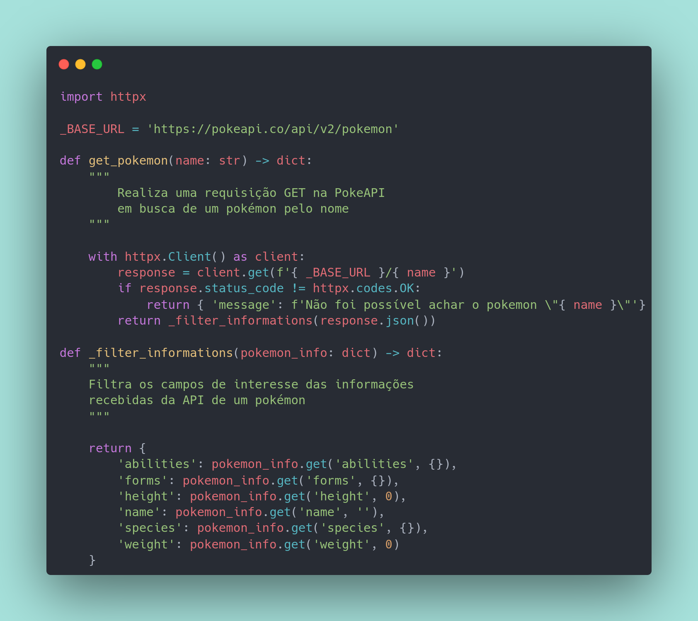
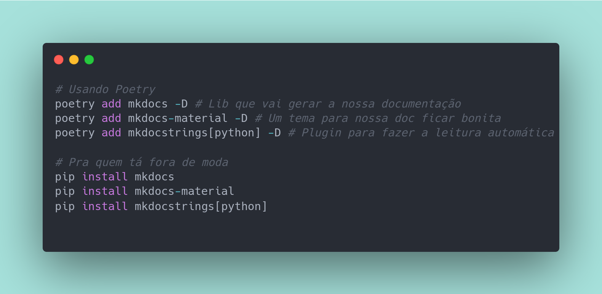
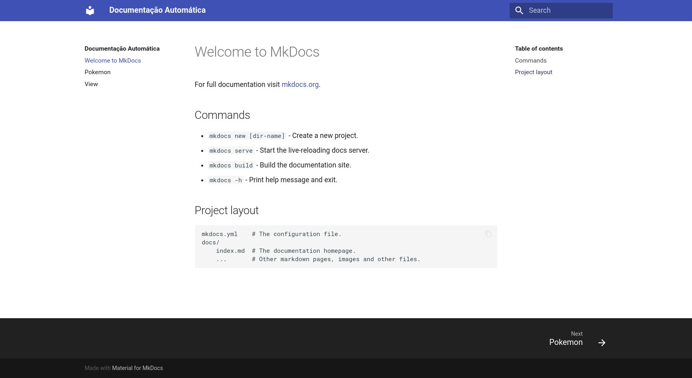
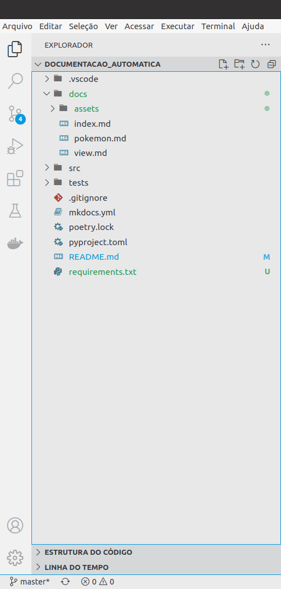
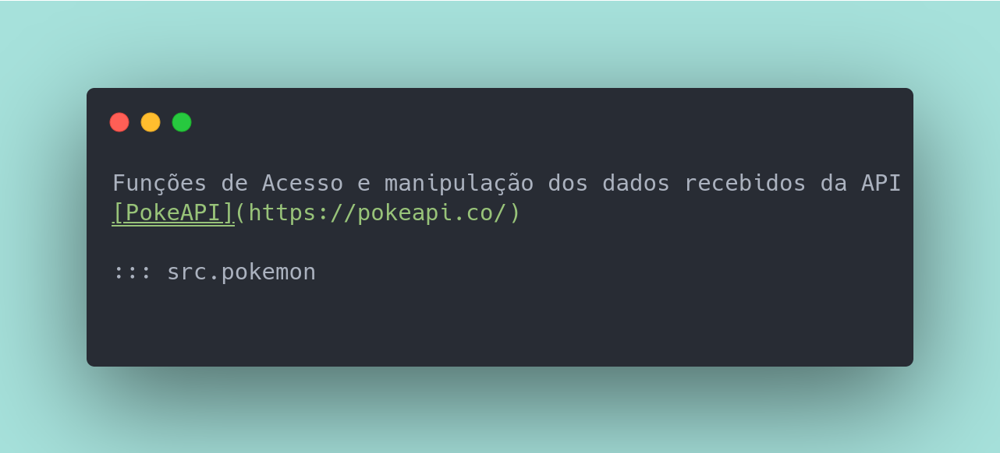

# Documentação Automática usando MkDocs e Python

Algo que curto muito é ficar navegando na documentação de libs sinceramente uma documentação é algo lindo de se ver e também difícil de manter.

Imagine toda vez que seja feita alguma alteração em um comportamento de algo ir na página que explica fazer um copy paste do código, escrever o que ela faz agora, fazer o build, checar se está tudo certo, êpa não era pra ficar assim... eu já cansei só de imaginar

Para facilitar isso existem algumas ferramentas como o MkDocs que facilitam bastante e nos ajudam a automatizar algumas tarefas chatas, nesse artigo vou escrever um pouco do que usei para fazer uma documentação de uma ferramenta Python, mas MkDocs é agnóstico de linguagem então pode ser feito com outras linguagens também só dar uma olhadinha na documentação deles!.

## Ferramenta a ser documentada

Fiz uma ferramenta bem simples que realiza uma chamada na PokeAPI e pega informações relacionadas a um pokémon e mostra no terminal.

O código fonte pode ser encontrado aqui: [Documentação automática](https://github.com/XandeCoding/codigos-de-artigos/tree/master/python/documentacao_automatica)

Falando um pouco mais do projeto usei o poetry para gerenciar o ambiente virtual e deixar isolado as libs que instalei, ninguém quer ficar entulhando o pc com um monte de libs não é mesmo, mas você pode usar qualquer outra como pyenv, virtualenvwrapper é indiferente.

Bem as libs que instalei estão no `pyproject.toml` e no `requirements.txt` então é só instalar (um _pip install -r requirements.txt_ deve funcionar) e começar a brincar.

## Como documentar



Esse é um pedacinho do código que vou usar como exemplo pra explicar para vocês, bem já deve ter reparado nessas `"""` elas são [Docstrings](https://peps.python.org/pep-0257/) são usadas para documentar o código é uma convenção bastante usada, para documentar módulos, classes, funções bem de qualquer forma se for documentar algo recomendo usar :stuck_out_tongue_winking_eye: .

Essas docstrings que vão realizar a mágica vamos fazer com que elas sejam lidas de forma automática e inseridas na respectiva página de documentação do módulo.

Bem com as docstrings inseridas e explicando o que cada função faz, vamos para prosseguir.

## Instalando o MkDocs

Para instalar usando o poetry é bastante fácil basta usar um poetry add ou _pip install_ caso não esteja o usando.



Bem instalamos o **mkdocs**, um tema para ficar no **mkdocs-material** é questão de gosto eu gosto muito, mas tem outros temas caso tenha interesse segue link [temas de MkDocs](https://www.mkdocs.org/user-guide/choosing-your-theme/). E por último temos o **mkdocstrings** ele é um plugin que percorre nosso projeto e insere as docstrings encontradas dentro de nossas páginas.

Mas bem como instalamos as libs, o que fazemos agora não precisa mandar uma carta para o caldeirão do hulk seguindo o passo a passo é bem simples e logo vai ter sua documentação pronta.

1 - Abra um terminal dentro da pasta do projeto e use o comando **`mkdocs new .`**, isso vai fazer com que os arquivos de configuração e a pasta _docs_ sejam criadas.

2 - Neste momento você já deve ter um arquivo chamado **`mkdocs.yml`** na raiz do seu projeto nele adicione as seguintes configurações.
```yml
site_name: Documentação Automática # Pode colocar o nome da sua aplicação
theme:
  name: material # Adiciona o tema bonitinho
plugins:
- search # Plugin que possibilita buscas pela documentação
- mkdocstrings: # Esse que faz a mágica, mais informações abaixo
    handlers:
      python:
        setup_commands:
          - import sys
          - sys.path.append("src")
    watch: # Live-reload para os mais íntimos - mais informações abaixo também
      - src
```
_Obs.: Sim adicionei o código meio feio, mas assim você pode só copiar e colar, minha preguiça saúda a sua :open_hands:_

* _mkdocstrings:_ Como já comentei ele que lê as docstrings e adiciona na respectiva página que é relacionada com o módulo, já vamos ver como usar. De resto adicionei um código python(sim ele aceita algumas funções python na configuração) para que a pasta `src` que é a que está o meu código seja reconhecido pela ferramenta caso alguma pasta sua não seja reconhecida assim como a minha foi esse é o caminho, basta adicionar ali.

* _watch:_ Isso faz com que ao realizar uma alteração no código a mesma seja atualizada para que a documentação esteja mais de acordo com a realidade, inclusive muito legal escrever a doc e já ver a mesma sendo inserida na página.

3 - Execute **`mkdocs build`** e depois **`mkdocs serve`** e ele vai deixar a sua doc accessível pelo navegador pela url `http://127.0.0.1:8000/`. Você deve ter algo parecido com isso abaixo.



4 - Ao acessar você vai ter uma pequena introdução de como adicionar páginas mas é muito simples basta criar um arquivo _.md_ dentro da pasta **docs** que está na raiz do seu projeto. Se está tudo indo certo você vai ter uma estrutura parecida com essa abaixo, mas foque na pasta **docs**.



5 - Vamos atacar a página pokemon ela que vou usar para documentar o meu módulo pokemón que vimos no ínicio.



* Temos uma pequena introdução do que se trata aquela página e logo após vemos um `::: src.pokemon` mas do que se trata isso. Bem ele que mapeia o arquivo que será inserido de forma automática e partir dali é inserido a doc, não acredita? Olha o resultado aí em baixo!


6 - Aproveite :grin:

# Fim

Em alguns passos já temos uma doc bem legal e caso tenhamos mais um módulo ou seja necessário adicionar mais uma página é bem simples é só criar na pasta docs e está feito. Espero que tenha gostado e qualquer dúvida (ou se achou alguma coisa errada, acontece nas melhoras familías) só mandar um comentário logo abaixo!.